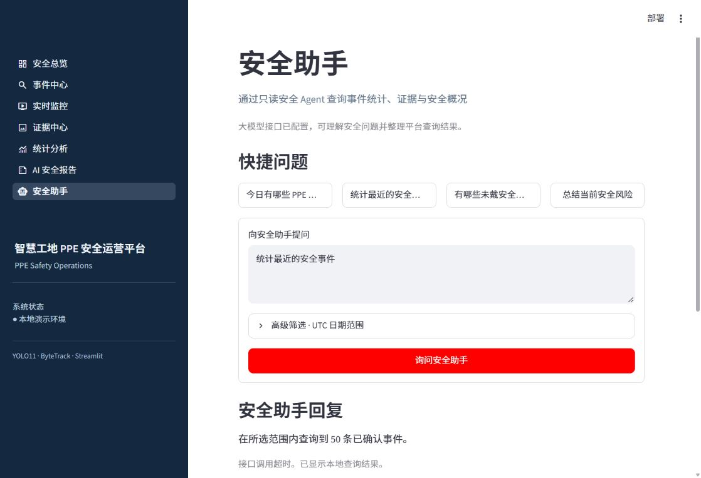
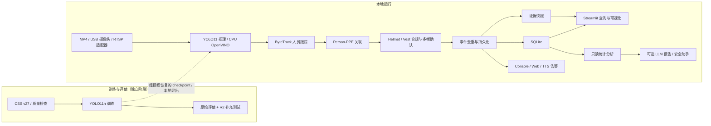

# 智慧工地 PPE 安全运营平台

**ODPlatform-PPE — Construction PPE Safety Operations Platform**

平台面向工地人员的安全帽、反光衣穿戴监测，结合目标检测、人员跟踪、规则判断、事件持久化、证据留存和智能分析，实现从视频监控到安全事件处理的闭环。当前交付范围是 **Windows 本地 V1 演示**；[当前状态](docs/02_CURRENT_STATUS.md)与[限制](#运行状态与限制)按各自证据单独披露。

## 项目展示

下图是仓库中已有的真实安全助手界面截图，展示了中文导航与本地查询结果。图中的接口超时提示也是该次运行的真实状态；它不代表提供方始终可用。



监控画面、事件与证据的完整人工演示步骤见[演示与答辩索引](docs/V1_DEMO_AND_DEFENSE.md)。当前仓库尚无适合公开展示的监控全链路截图。

## 主要功能

| 能力 | 当前实现与证据边界 |
| --- | --- |
| YOLO11 PPE 检测 | 项目训练的 YOLO11n 检测 person、安全帽/未戴安全帽、反光衣/未穿反光衣，并保留 machinery、vehicle 两类场景目标；支持图片与按序 MP4 推理。[训练与评估](docs/reports/phase-09/V1_COMPLETION_REPORT.md) |
| 人员跟踪与 PPE 关联 | 通过 Ultralytics 集成的 ByteTrack 跟踪 person，关联 PPE 候选；有歧义时保留 unknown，不强行归属。[P9-B 验收](docs/reports/phase-09/P9B3_CHARTER_GATE_READJUDICATION_REPORT.md) |
| 多帧规则与事件 | Helmet/Vest 规则经时序确认后创建违规事件；活动周期内去重，并支持恢复与冷却。反光衣短暂冲突证据处理遵循 [ADR-024](docs/03_TECHNICAL_DECISIONS.md)。 |
| 记录、留证与告警 | SQLite 持久化事件和处理状态，JPEG 快照带完整性校验；Console/Web/TTS 告警失败与事件主流程隔离。告警数统计的是通道投递次数，可能大于事件数。 |
| 本地监控与管理 | Streamlit 提供安全总览、事件中心、实时监控、证据中心、统计分析、AI 报告和安全助手；MP4 与 USB 摄像头有实际运行证据，RTSP 有受控本地流验证。[P9-D 记录](docs/reports/phase-09/P9D_UI_UX_POLISH_REPORT.md) |
| 可选 DeepSeek 分析 | 报告基于已持久化数据并经结构和依据校验；失败时标记本地模板降级。安全助手只调用受控只读工具，可选用模型规划及选择已验证陈述。[V1 报告](docs/reports/phase-09/V1_COMPLETION_REPORT.md) |

## 系统架构



训练和评估不在网页监控进程中执行。LLM/Agent 位于已确认事件的只读下游，不能决定或修改检测、关联及 PPE 合规结果。

## 技术栈

本地演示基线是 Windows、Python **3.12.1**、CPU。完整依赖以 [FINAL-DEMO-RUNTIME-001 锁文件](locks/FINAL-DEMO-RUNTIME-001/requirements.txt)为准；其中 PyTorch **2.5.1+cpu**、Ultralytics **8.4.157**、OpenCV **5.0.0.93**、Streamlit **1.64.0**、NumPy **2.2.6**、`lap` **0.5.13**。实时 CPU 配置额外使用 OpenVINO **2025.2.0**；ByteTrack 通过 Ultralytics 集成，SQLite 用于事件存储，DeepSeek 是可选的服务端提供方。

历史训练环境与本地演示环境不同；训练用 CUDA 配置不是运行网页所需条件。项目包的 `pyproject.toml` 不自动安装完整演示依赖。

## 快速开始（Windows PowerShell）

在项目根目录运行。最终演示预检要求 **Python 3.12.1**；`py -3.12` 只选择 3.12 系列，不保证一定是 3.12.1。先确认版本输出，再创建虚拟环境。其余命令始终使用该虚拟环境的 Python：

```powershell
py -3.12 --version
py -3.12 -m venv .venv-final-demo
& '.\.venv-final-demo\Scripts\python.exe' -m pip install -r locks/FINAL-DEMO-RUNTIME-001/requirements.txt
& '.\.venv-final-demo\Scripts\python.exe' -m pip install openvino==2025.2.0
& '.\.venv-final-demo\Scripts\python.exe' -m pip install --no-deps .
& '.\.venv-final-demo\Scripts\python.exe' scripts/preflight.py
& '.\.venv-final-demo\Scripts\python.exe' -m streamlit run web/Home.py --server.port 8502 --server.address 127.0.0.1 --server.headless true
```

浏览器访问 `http://localhost:8502/`。以 `--server.headless true` 启动时，无需在终端处理首次使用的邮箱提示；手动打开地址即可。先在监控页停止检测，再用 Ctrl+C 关闭服务。

**克隆仓库后不能直接完整演示。** 模型 checkpoint、416 像素 OpenVINO 导出、数据集和演示视频等大文件未随 Git 分发。请从经授权的项目资产备份恢复 `models/checkpoints/EXP-001/best.pt` 和 `models/exports/best_cpu_416_openvino_model/`，以及所需演示素材；缺失或哈希不符时以预检结果为准，不下载替代权重。持有已核验 checkpoint 的维护者可按 [CPU 性能报告](docs/reports/phase-09/P9_CPU_24FPS_REPORT.md)中的流程重新导出，但导出脚本会写入配置哈希，不能用未审核导出结果冒充冻结资产。

DeepSeek API Key **可选**；未配置时仍可使用经标记的本地报告降级和受控查询。仅按[本地部署指南](docs/V1_DEPLOYMENT_GUIDE.md#private-deepseek-configuration)配置 Git 忽略的服务端文件，不要把凭据写入 README、提交记录或截图。安装、备份、故障恢复及端口问题也见该指南。

## 数据集与训练

数据来自 [Roboflow Construction Site Safety v27](https://universe.roboflow.com/roboflow-universe-projects/construction-site-safety/dataset/27)，直接导出的冻结快照共 **2,799** 张图（train/valid/test：**2603/114/82**）。项目将源数据映射为七个训练类别，其中前五类为 person、hardhat、no_hardhat、vest、no_vest；原始数据与生成数据均不提交 Git。[Dataset Card](docs/06_DATASET_CARD.md)记录了导出元数据与实际文件的差异。

对两组已复核的 valid/test 同场景邻近帧，独立 **R2 划分**将两个 test 样本移入 valid，得到 **2603/116/80**。训练集每个文件与原版相同，EXP-001 checkpoint 未重训；R2 仅用于补充测试。R2 的精确哈希及 dHash 距离 ≤5 的跨划分候选为零，这不证明不存在其他语义或场景相似性。[R2 质量记录](docs/reports/phase-09/V1_SPLIT_R2_QUALITY.md)。

该数据集标注为 **CC BY 4.0**；署名、许可链接及再分发前复核事项见[Dataset Card](docs/06_DATASET_CARD.md)。

## 模型与处理速度

以下指标属于不同数据划分，不能直接当作同一测试集上的前后提升：

| 评估 | Precision | Recall | mAP50 | mAP50-95 |
| --- | ---: | ---: | ---: | ---: |
| EXP-001 原始训练验证，历史指标 | 0.899 | 0.649 | 0.767 | 0.480 |
| 未重训 checkpoint 的 R2 测试集，80 张图 / 七类 | 0.795859 | 0.709828 | 0.729892 | 0.462068 |

原始指标来源见[训练记录](docs/reports/EXP-001_TRAINING_EXECUTION_REPORT.md)，R2 原始数值与逐类 AP 见[补充评估 JSON](docs/reports/phase-09/V1_SPLIT_R2_EVALUATION.json)。

在 **Intel Core i5-1340P、Windows、CPU-only、OpenVINO 2025.2.0、416 像素配置**下，指定 **570 帧 / 1280×720 / 30 FPS MP4** 的两次热态完整处理实验为 **28.836**、**29.414 processed FPS**；实际 Console/Web/TTS 告警适配器开启的另一轮为 **26.000 processed FPS**。指标是处理帧数除以墙钟时间，包含解码、推理、跟踪、关联、事件与快照等，不是视频源帧率或浏览器显示帧率。[方法和原始结果](docs/reports/phase-09/P9_CPU_24FPS_REPORT.md)。这些实验不保证所有 USB/RTSP 来源达到 24 FPS，也不证明广泛场景识别准确率。

## 项目结构

```text
core/       检测、输入源、跟踪、关联、规则、事件与 Agent 的核心契约和逻辑
services/   数据处理、训练评估、监控、事件、报告与 Agent 的服务编排
infra/      SQLite、证据存储、告警/TTS 与 LLM 通信适配
web/        Streamlit 页面及受控 Web 边界
configs/    推理、训练、评估等配置；本地密钥文件被 Git 忽略
scripts/    预检、数据准备、训练评估、推理和交付命令
tests/      单元、集成与端到端测试
docs/       治理、设计、验证报告及交接
data/       外部快照、中间数据、处理数据与样例；数据载荷不入 Git
models/     预训练权重、项目 checkpoint 与导出模型；二进制资产不入 Git
locks/      训练、评估与最终演示环境的冻结依赖
artifacts/  本地事件、快照、日志、推理及验证产物；运行数据不入 Git
```

诊断运行器位于 `diagnostics/`；最小用法示例位于 `examples/`。仓库目录说明与历史文档地图见[文档索引](docs/README.md)。

## 运行状态与限制

- 本地 V1 演示在 **远端 RTSP 和长期稳定性明确排除的范围内**准备就绪；这不代表项目章程的完整验收，也不代表云端或生产部署已验收。P9-D 页面优化仍需人工检查响应式布局并完成演示复核。
- **第四阶段的离线推理已完成**（Phase 4 — Offline Inference）。摄像头和 RTSP 是延期至后续阶段实现的 V1 必需项（Camera / RTSP: Deferred MUST；M-008 CHARTER ACCEPTED，经真实 USB Camera 验收）。章程 M-008 的“摄像头或 RTSP”条件已满足；远端 RTSP 的长期恢复能力本轮未验证。
- **P9-C：部分完成、维持冻结**（PARTIAL / FROZEN）。有限实验强烈支持“真实推理与每周期新建工作线程的组合”与观测到的资源增长相关；具体保留对象和是否无限增长仍未确认。[诊断报告](docs/reports/phase-09/P9C3I_INFERENCE_WORKER_LIFECYCLE_REPORT.md)。
- 模型对遮挡、小目标及复杂交叉场景的广泛准确率没有完成证明；416 像素 CPU 配置也未证明与原 640 像素离线配置在所有场景等效。
- 安全助手采用受控只读工具与进程内审计；持久化 Agent 审计、生产级身份认证、云端部署与全量人工答辩演示均不在当前已验证结论中。

## 文档导航

- [项目 Charter 与 MUST 验收](docs/00_PROJECT_CHARTER.md)
- [当前状态](docs/02_CURRENT_STATUS.md) · [测试门禁](docs/05_TEST_GATES.md)
- [Dataset Card](docs/06_DATASET_CARD.md) · [开源使用与许可记录](docs/07_OPEN_SOURCE_USAGE.md)
- [V1 部署与故障恢复](docs/V1_DEPLOYMENT_GUIDE.md) · [演示与答辩索引](docs/V1_DEMO_AND_DEFENSE.md)
- [V1 补齐与当前限制](docs/reports/phase-09/V1_COMPLETION_REPORT.md) · [CPU 性能报告](docs/reports/phase-09/P9_CPU_24FPS_REPORT.md)

## 许可证及致谢

**本仓库尚未声明独立的源代码许可证；项目自有代码的使用和再分发权限以实际授权为准。** 数据集的 **CC BY 4.0** 许可不能自动用于项目代码；通过依赖使用的 [Ultralytics](https://github.com/ultralytics/ultralytics) 另有 **AGPL-3.0** 义务，公开分发前应分别复核。[完整来源与许可证据](docs/07_OPEN_SOURCE_USAGE.md)。

感谢 [Roboflow Universe Projects / Construction Site Safety](https://universe.roboflow.com/roboflow-universe-projects/construction-site-safety) 数据来源，以及 [PyTorch](https://pytorch.org/)、[OpenVINO](https://docs.openvino.ai/)、[OpenCV](https://opencv.org/)、[Streamlit](https://streamlit.io/) 与 [ByteTrack](https://github.com/FoundationVision/ByteTrack) 等开源项目。DeepSeek 仅为可选外部 API；其输出须通过本项目校验，服务不可用时使用本地降级。
