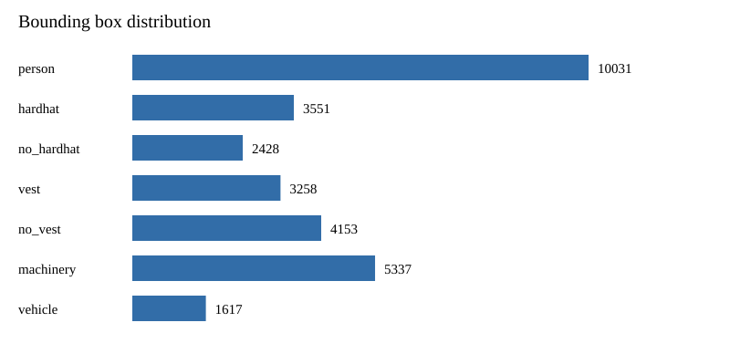
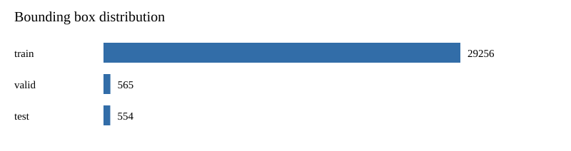

# Dataset Quality Report

> Status: QUALITY ASSESSED / PAYLOAD IMMUTABLE

## 1 Dataset Identity

- Dataset: `CSS-PPE-10-V1-SPLIT-R2`
- Mapping: `PPE-MAPPING-V1`
- Processed directory: `css-ppe-10-v1-split-r2`
- Payload files: `5599`

## 2 Validation Method

Observation only. No image, label, `data.yaml`, or metadata payload file was repaired, rewritten, or deleted.

Payload scope:

```text
data.yaml
train/images + labels
valid/images + labels
test/images + labels
```

- Payload hash before: `c08aff491e086fb8f97ebda28d1db738ab2fee6d4ea1c8959fa2e3cb1f0d12a3`
- Payload hash after: `c08aff491e086fb8f97ebda28d1db738ab2fee6d4ea1c8959fa2e3cb1f0d12a3`
- Hash unchanged: `TRUE`

## 3 Dataset Structure

Structure status: `PASS`

| Split | Images | Labels | Counts match | Empty labels |
| --- | ---: | ---: | --- | ---: |
| train | 2603 | 2603 | TRUE | 11 |
| valid | 116 | 116 | TRUE | 13 |
| test | 80 | 80 | TRUE | 8 |

Missing labels: `0`
Orphan labels: `0`
Zero-byte images: `0`

## 4 Class Distribution

| ID | Class | Train boxes | Valid boxes | Test boxes | Total | Share |
| ---: | --- | ---: | ---: | ---: | ---: | ---: |
| 0 | `person` | 9691 | 168 | 172 | 10031 | 0.3302 |
| 1 | `hardhat` | 3362 | 80 | 109 | 3551 | 0.1169 |
| 2 | `no_hardhat` | 2318 | 70 | 40 | 2428 | 0.0799 |
| 3 | `vest` | 3156 | 42 | 60 | 3258 | 0.1073 |
| 4 | `no_vest` | 3957 | 107 | 89 | 4153 | 0.1367 |
| 5 | `machinery` | 5238 | 56 | 43 | 5337 | 0.1757 |
| 6 | `vehicle` | 1534 | 42 | 41 | 1617 | 0.0532 |

Total boxes: `30375`
PPE five-class box count: `23421` (`0.7711` of all boxes)
Maximum-to-minimum class ratio: `6.203463203463204`

## 5 Empty Labels

- Label files: `2799`
- Empty labels: `32`
- Empty-label ratio: `0.0114`
- Classification: image without object; retained in place.

| Split | Empty labels |
| --- | ---: |
| train | 11 |
| valid | 13 |
| test | 8 |

## 6 Bounding Box Quality

| Metric | Count |
| --- | ---: |
| Total label lines | 30375 |
| Valid bboxes | 30375 |
| Invalid bboxes | 0 |
| Invalid class IDs | 0 |
| Invalid coordinates | 0 |
| Malformed lines | 0 |

Issue-code counts:

```json
{}
```

## 7 Small Object Analysis

- Overall: small `10599`, medium `10893`, large `8883`
- Thresholds: small `< 0.01`, medium `< 0.09`, large `>= 0.09`

| Class | Total | Small | Small share | Risk |
| --- | ---: | ---: | ---: | --- |
| `person` | 10031 | 2291 | 0.2284 | MEDIUM |
| `hardhat` | 3551 | 2789 | 0.7854 | HIGH |
| `no_hardhat` | 2428 | 1318 | 0.5428 | HIGH |
| `vest` | 3258 | 1653 | 0.5074 | HIGH |
| `no_vest` | 4153 | 1269 | 0.3056 | MEDIUM |
| `machinery` | 5337 | 378 | 0.0708 | LOW |
| `vehicle` | 1617 | 901 | 0.5572 | HIGH |

## 8 Duplicate Analysis

Exact image duplicates:

- Groups: `0`
- Same-split groups: `0`
- Cross-split groups: `0`

Perceptual dHash candidates:

- Algorithm: `dHash`
- Hamming threshold: `5`
- Hashed images: `2799`
- Candidate pairs: `5`
- Same-split candidate pairs: `5`
- Cross-split candidate pairs: `0`
- Candidate groups: `5`
- Decoder failures: `0`
- Mutation: `NOT ALLOWED`; candidates are risk evidence only.

## 9 Leakage Analysis

- Exact cross-split leakage groups: `0`
- Perceptual cross-split candidate groups: `0`
- Perceptual cross-split candidate pairs: `0`
- Leakage detected: `FALSE`

No exact cross-split image groups were detected.

No perceptual cross-split candidate groups were detected.

## 10 Risks

- `MEDIUM` `HIGH_SMALL_OBJECT_RISK`: Plan class-aware validation and small-object evaluation.
- `MEDIUM` `CLASS_IMBALANCE_OBSERVED`: Use per-class metrics and evaluate class-aware training strategies in later approved phases.
- `INFO` `EMPTY_LABELS_OBSERVED`: Retain as valid images without target objects; do not delete solely for being empty.

## 11 Conclusion

Quality assessed. The payload remained byte-identical before and after validation. No dataset cleaning, repair, deletion, relabeling, remapping, or resplitting was performed.

Any data correction requires a new dataset version and a new frozen artifact fingerprint.


## 12 Distribution Charts




